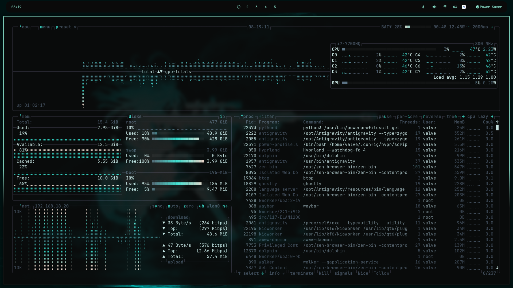
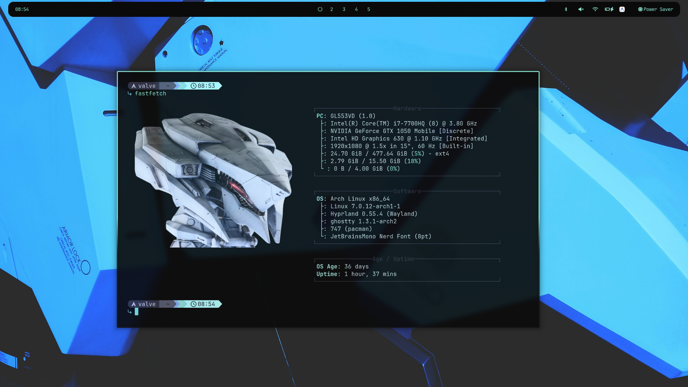

# HV-dotfiles (Blackturq Theme)

This repository contains my personal dotfiles for a minimal **Arch Linux** setup powered by the **Hyprland** Wayland compositor. The entire configuration is styled with a custom deep black and vibrant turquoise color palette called **Blackturq**.

## Screenshots

<p align="center">
  
  
</p>

## Components Included

This setup provides a complete desktop experience with the following tools configured to match the Blackturq theme:

* **Window Manager / Compositor:** Hyprland
* **Status Bar:** Waybar
* **Terminal Emulators:** Ghostty & Kitty
* **App Launcher:** Walker
* **Notification Daemon:** Mako
* **System Monitoring / Info:** Btop, Htop, Fastfetch
* **Audio Visualizer:** Cava
* **Volume/Brightness OSD:** SwayOSD
* **File Manager:** Dolphin (KDE/Qt) with custom `Blackturq.colors`
* **GTK Theme:** Custom GTK3 and GTK4 Blackturq stylesheet (used by Electron apps and GNOME tools)
* **Shell:** Zsh with Starship prompt

## Installation

A comprehensive installation script is provided to automate the setup process on a fresh minimal Arch Linux installation. It will install an AUR helper (`yay`), all necessary packages (via `pacman` and `yay`), and deploy the configurations.

### 1. Clone the repository
```bash
git clone https://github.com/yourusername/HV-dotfiles.git ~/HV-dotfiles
cd ~/HV-dotfiles
```

### 2. Run the Setup Script
You have two options for deploying the configurations:

**Option A: Copy Mode (Default)**
Copies the configuration files directly into your `~/.config/` directory.
```bash
./setup.sh
```

**Option B: Symlink Mode**
Creates symbolic links in `~/.config/` pointing to the files in this repository. This is useful if you want to keep tracking changes with git directly from the repo folder.
```bash
./setup.sh --symlink
```

> **Note:** The setup script will automatically backup any existing configurations to `~/.config.bak/<timestamp>/` before replacing them.

### Post-Installation Notes
After the script completes, remember to:
1. Enable necessary services manually:
   ```bash
   sudo systemctl enable --now NetworkManager
   sudo systemctl enable --now bluetooth
   systemctl --user enable --now pipewire.service
   systemctl --user enable --now pipewire-pulse.service
   systemctl --user enable --now wireplumber.service
   ```
2. Place your preferred wallpaper at `~/Pictures/backgrounds/omarchy-wp.png` (the directory is created automatically by the script).
3. Install your specific GPU drivers (e.g., `nvidia nvidia-utils`, `xf86-video-amdgpu`, etc.).
4. Restart your session or reboot.

## Pulling Local Changes

If you used the "Copy Mode" during installation and later make changes to your active configurations in `~/.config/` or system theme folders, you can easily pull those changes back into the `HV-dotfiles` repository before committing to Git.

Simply run the included pull script:
```bash
cd ~/HV-dotfiles
./pull.sh
```
This script acts as the reverse of `setup.sh`, updating the repository files with your active system settings.
